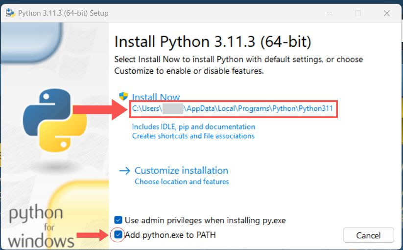
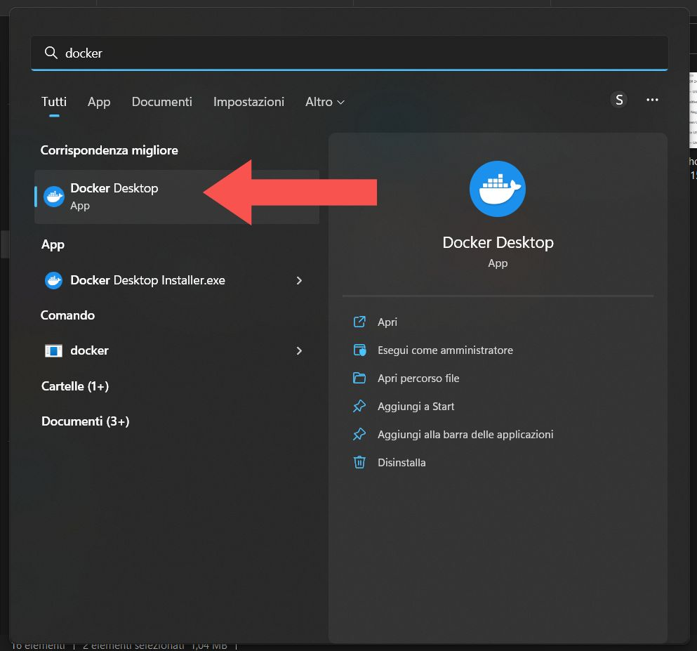
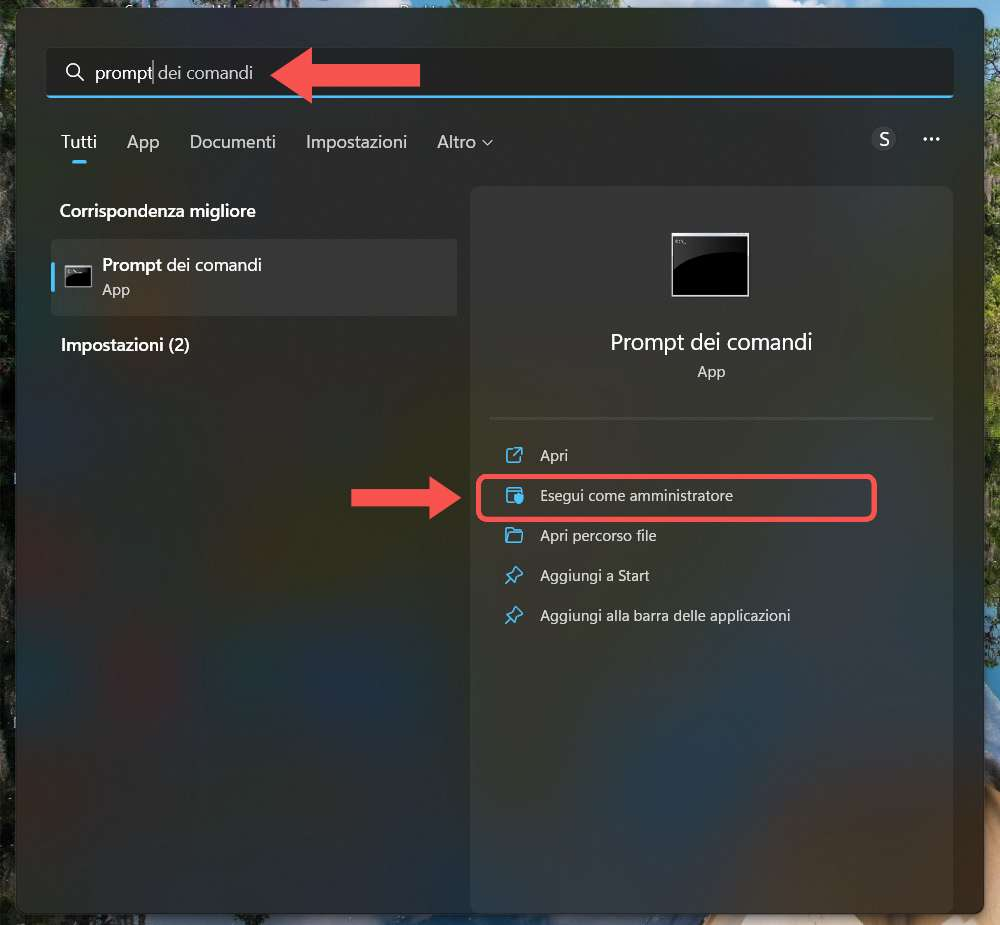
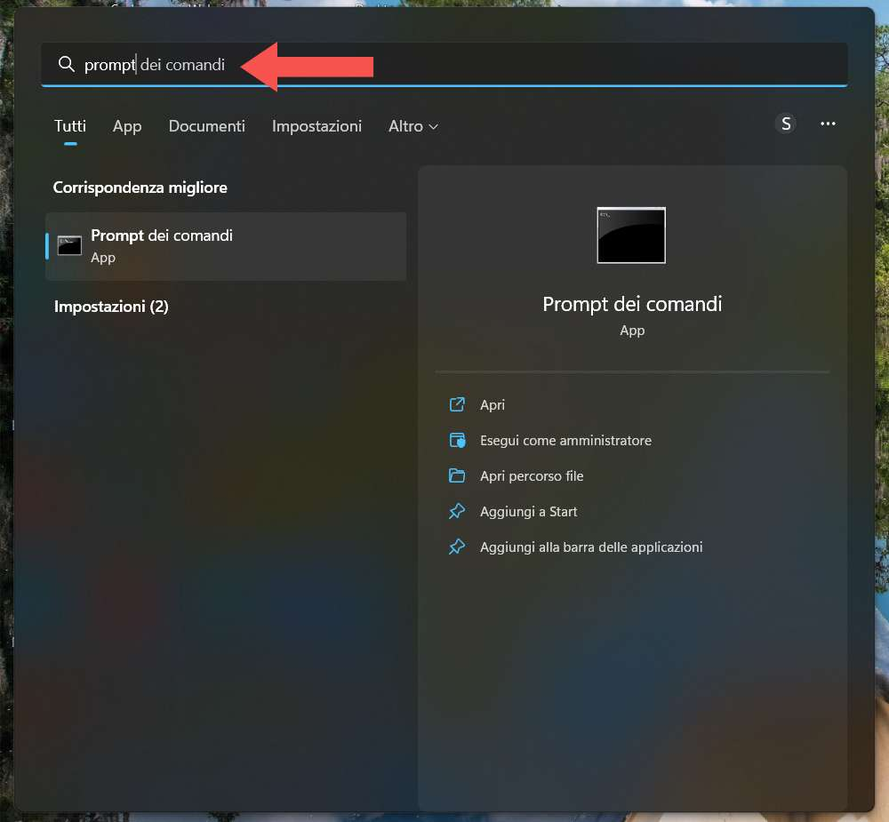
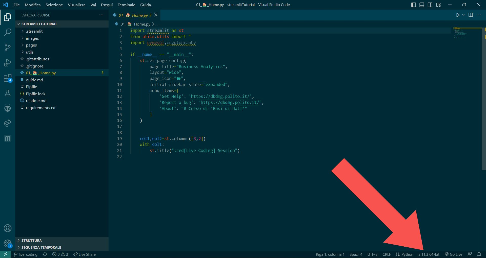
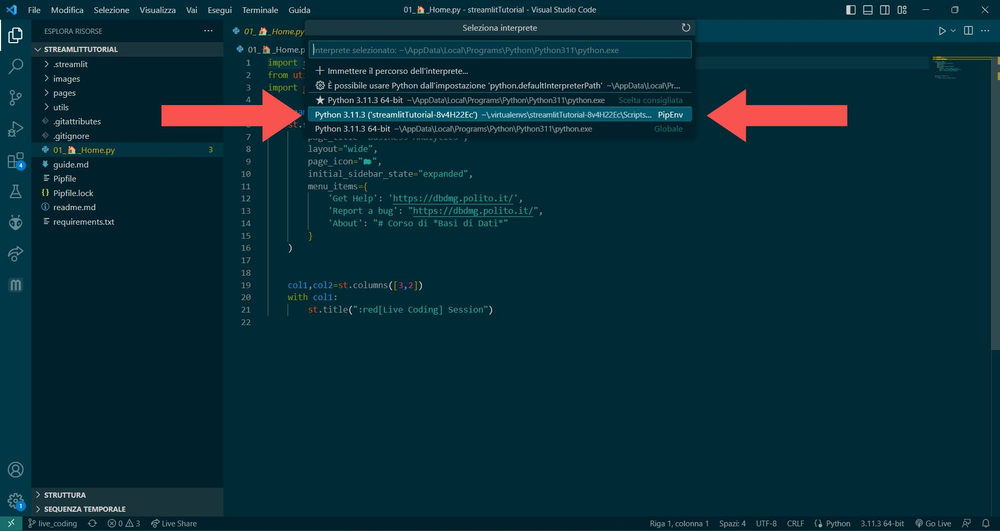

# Streamlit su Windows

## 1. Preparativi
-  Installare [Docker Desktop](https://www.docker.com/products/docker-desktop/)

- Installare [Python3](https://www.python.org/downloads/)

:warning: Se hai Python 3.9.7 dovrai reinstallare l'ultima versione in quanto non è supportata da streamlit :warning:\
:warning: Non installare una versione di Python >3.11. Per ora Streamlit supporta dalla versione 3.7 alla 3.11 (con eccezioni) :warning:

Controlla le impostazioni di installazione (come da foto).
**Segnarsi il percorso di installazione evidenziato in foto.**\
Assicurarsi anche di attivare "Add Python.exe to PATH".

Ora è possibile installare Python


- Installare [git](https://git-scm.com/download/win), selezionando la versione Windows 64bit standalone (è possibile lasciare tutte le impostazioni di default durante l'installazione)

- **RIAVVIARE IL COMPUTER**

- Avviare Docker Desktop


:warning: :warning: :warning:
se l'avvio di Docker da' un errore riguardante un aggiornamento usare il prompt dei comandi COME AMMINISTRATORE e eseguire
``` bash
wsl --update --web-download
```


Avviare nuovamente Docker Desktop e attendere che finisca il caricamento prima di eseguire i prossimi comandi

:warning: :warning: :warning:

<br>

## 2. Prompt dei comandi
Ogni comando va eseguito nel prompt dei comandi, premendo ENTER per eseguirlo. Un comando è in esecuzione fino a quando non ritorna il nome della directory corrente e il simbolo `>`. (es. `C:\Users\<nomeutente>`)\
Lasciar quindi eseguire il comando finchè non avra terminato l'esecuzione prima di immetterne un altro. Alcuni comandi come l'installazione dei requirements con `pip` potrebbero impiegare svariati minuti

Per aprire il prompt corretto:

``` bash
mkdir bdd_streamlit
cd bdd_streamlit
git clone https://github.com/AndreaAvignone/mysql-docker.git
cd mysql-docker
docker compose up -d
```

con questi comandi abbiamo creato la cartella `bdd_streamlit` (all'interno del percorso `C:\Users\<nome utente>`) che conterrà tutti i nostri file del progetto streamlit. Con l'ultimo comando abbiamo avviato i container Docker per il DB `mysql` e per l'interfaccia web `phpmyadmin`. L'interfaccia di `phpmyadmin` è disponibile all'indirizzo `http://localhost:8081` accessibile con username `student` e password `user_pwd`\
(modificabili tramite il file `.env` nella cartella `mysql-docker`, previo arresto e riavvio dei container)

Ora copiamo i file del progetto e avviamo streamlit<br>
``` bash
cd ..  
git clone https://github.com/AndreaAvignone/streamlitTutorial.git  
cd streamlitTutorial  
git checkout live_coding  
py -m pip install pipenv  
pipenv --python <Percorso di installazione di python>\python.exe shell  
pip install -r requirements.txt  
python -m streamlit run 01_🏠_Home.py
```
:information_source: :information_source: :information_source: \
il percorso al comando 6 sarà quindi quello segnato al momento dell'installazione di Python con l'aggiunta di `\python.exe`, sarà quindi simile a questo:
``` bash
pipenv --python C:\Users\<nome utente>\AppData\Local\Programs\Python\Python311\python.exe shell
```
:information_source: :information_source: :information_source:

Fatto questo tutto dovrebbe funzionare correttamente e aprire in automatico la pagina di streamlit nel browser predefinito

<br>

## (Facoltativo) Editare con VSCode
Sarà anche possibile aprire i file in VS Code per editarli in modo facile.
Di default la cartella di installazione sarà questa:  
`C:\Users\<nome_utente>\bdd_streamlit\streamlitTutorial`
Una volta aperta la cartella contenente il progetto bisognerà solo più selezionare l'interprete Python corretto in modo che riconosca l'ambiente `pipenv` in cui abbiamo installato le dipendenze

Selezionare ora l'interprete corretto, è quello con **PipEnv come indicatore al fondo**


Ora avremo quindi l'highlight della sintassi e i moduli verranno caricati correttamente da VSCode
<br>

## 3. Avvio di Streamlit successivamente
Per riavviare streamlit le volte successive (dopo un riavvio del pc o se chiudi il terminale) sarà necessario:

1. Avviare Docker Desktop
2. Aprire prompt comandi
3. `cd bdd_streamlit`\
:warning: se la directory di installazione è diversa da quella di default sarà necessario spostarsi in quella corretta :warning:
4. `cd mysql-docker`
5. `docker compose up -d`
6. `cd ..`
7. `cd streamlitTutorial`
8. `pipenv --python <Percorso della foto>\python.exe shell`
9. `python -m streamlit run 01_🏠_Home.py`